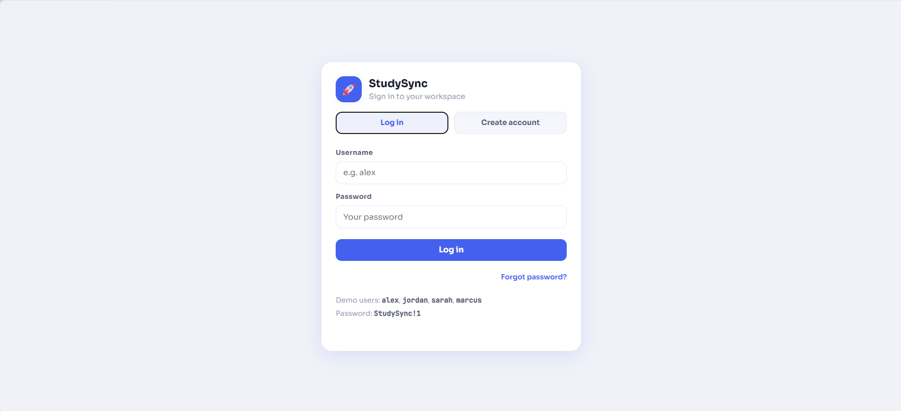
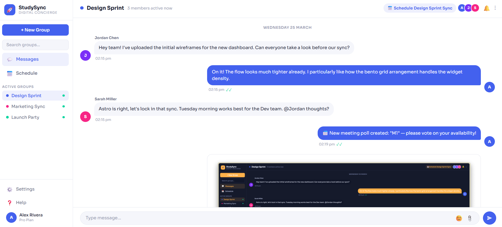
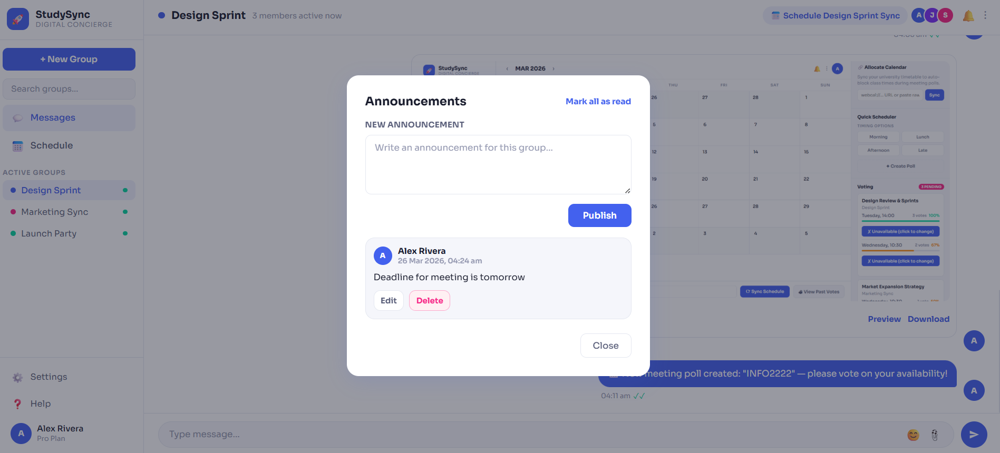
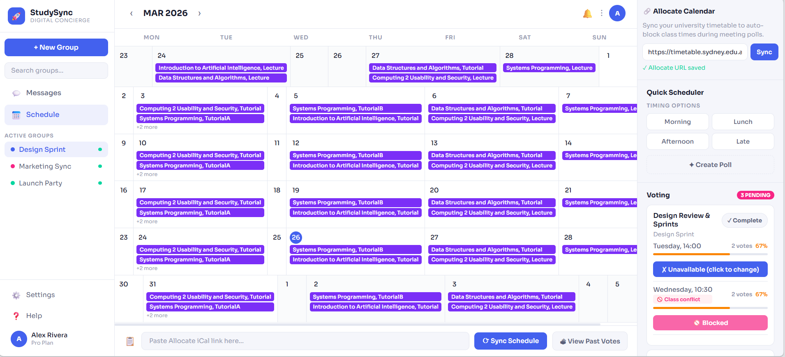
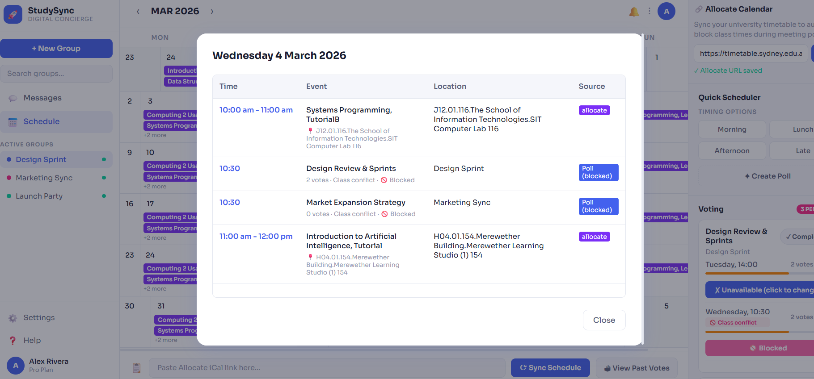
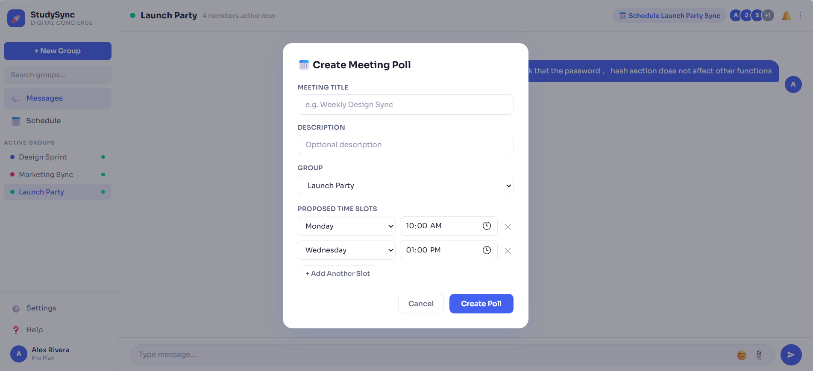
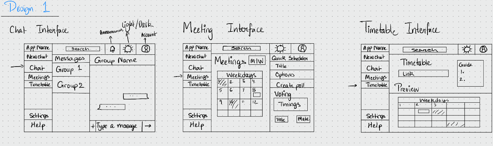
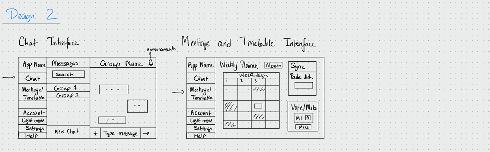

# StudySync

A collaborative study group platform for both communicating effectively and organising meetings in the same place with a focus on security.

## Project Background

This project was developed to explore both human computer interaction (HCI) and secure web application development while building a collaborative platform for student study groups. 

Through user research, we identified group work often requires multiple platforms for tasks such as communication and scheduling meetings. This project integrates workflows into one platform, while also implementing modern security practices such as secure authentication and encrypted messages.

## Screenshots

### Login Screen


### Group Chats


### Announcements


### Calendar


### Day View


### Meeting Scheduler



## Features

- Study group creation and management
- Real time messaging with file sharing
- Persistent announcements
- Meeting scheduling with availability voting
- University timetable integration

## Tech Stack

**Frontend:** HTML, CSS, JavaScript

**Backend:** Flask (Python)

**Database:** SQLite

**Authentication:** Argon2 Password Hashing

**Cryptography:** Python `cryptography` library

**Security:** HTTPS, Secure Session Management

## Security

- Argon2id password hashing
- HTTPS enforced
- End-to-end message encryption
- Secure session cookies
- Password history tracking to prevent reuse
- Login rate limiting

## Human Computer Interaction (HCI)

StudySync followed a user centred design process involving interviews, prototyping, and iterative refinement.

### Research

Research identified several recurring challenges (which directly informed the implemented features):

- Important information becomes buried within chat conversations.
- Scheduling meetings requires multiple applications.
- Group responsibilities are difficult to coordinate.
- Students prefer an all-in-one collaboration platform.

### Design Iteration

The following two are examples of refined prototypes created using the 10 plus 10 method:




## Local Development

### Prerequisites
- Python 3.8 or higher
- pip package manager

### Setup

1. Clone or download the repository
2. Either run `./install.sh`,  or continue with manual setup below.
3. Create a virtual environment:
   ```bash
   python -m venv .venv
   ```
4. Activate the virtual environment:
   - Windows:
     ```bash
     .venv\Scripts\activate
     ```
   - macOS/Linux:
     ```bash
     source .venv/bin/activate
     ```
5. Install dependencies:
   ```bash
   pip install -r requirements.txt
   ```

6. Create a `.env` file (optional, for custom configuration):
   ```env
   SECRET_KEY=your-secret-key-here
   DB_PATH=./studysync.db
   UPLOAD_DIR=./uploads
   FORCE_HTTPS=0
   ```

### Running the Application

For local development, use the secure server with self-signed certificates:
```bash
python run_secure.py
```

Or for production deployment (without local certificate handling):
```bash
python run.py
```

The application will be available at `https://localhost:8765`

### Default Credentials

A fresh database includes demo users with the following credentials:
- Username: `alex`, Password: `StudySync!1`
- Username: `jordan`, Password: `StudySync!1`
- Username: `sarah`, Password: `StudySync!1`
- Username: `marcus`, Password: `StudySync!1`
